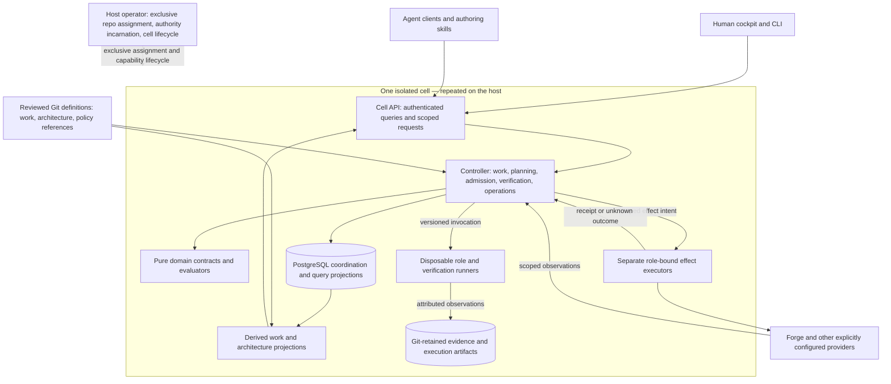

# A whole-system target for Assay

**Draft proposal, 10 October 2026.** Part of the [public architecture proposal](README.md), not an approved target or deployment authorization. The requested design starts with one host containing multiple isolated cells, permits command breaks where they simplify the design, reconciles affected unfinished plans together, and includes the service and cockpit in public Assay. PostgreSQL coordinates runtime work; recovery should reconstruct useful state while permitting classified transient loss and safe repeated work. See [storage and recovery](14-storage-forge-graph.md).

## Design the product around governed operations

Build one public Assay product with a shared domain model, a durable controller for each cell, isolated execution and effect authority, and cockpit as its human client. Organize it around **intent → admission → execution → evidence → acceptance → observation**, rather than preserving cellctl, desk-tools and statusgen as three architectural pillars.

The unit of deployment is a cell. The unit of durable work is a revision-bound obligation and its attempts. The unit of acceptance is a claim supported by applicable evidence under a particular contract. The unit of improvement is an enduring operational subject, with measurements before and after a change. A successful process, delivered change, deployment, exposure and improved outcome remain different facts. This follows the direction of [PR #2492's vision](https://github.com/medici-finance/assay/blob/466c36a794bad4e837c61fe1a3335572bd458e15/docs/vision/README.md), without treating its proposed capabilities as shipped.

Start with a **modular Go application**, not a distributed service for every domain. Reuse sound reducers, protocols and tests; replace incompatible implementations. TypeScript clients can be generated from the wire contracts; no frontend framework replacement is necessary to establish the architecture. Use a small number of process boundaries where custody, untrusted execution or independent lifecycle requires them.

The diagram shows logical responsibilities; the provider-read arrow uses an authorized adapter, never ambient credentials. It does not put every box in a daemon. A planning graph is read-side context; it cannot authorize a runtime action.

## One semantic owner for each domain

| Domain | Meaning owned here | Boundaries |
|---|---|---|
| Definitions and planning | Work definitions, requirements, architecture targets, contracts, change sets and their revisions | Markdown remains the narrative; structured records make selected relationships traversable. Plans do not assert deployment. |
| Work and policy | Eligibility, dependency satisfaction, delivery facts, review currency, acceptance obligations and explainable holds | Pure evaluation over explicit observations and policy versions. No token minting, process launch or hidden network reads. |
| Runtime coordination | Attempts, leases/generations, schedules, cancellations, recovery, bounded budgets and effect intents | A simple desk item need not instantiate a general workflow graph. Both desk and workflow adapters use the same admission and ownership semantics. |
| Evidence and decisions | Evidence subjects, applicability, independent verification, human decisions, publication receipts and acceptance assessment | Execution success cannot grant acceptance; evidence publication cannot answer a human gate. |
| Provider effects | Typed external reads/writes, repository coordinates, identity, conditional effects and reconciliation | Credential custody stays outside working sessions. Each effect executor has only its role's authority; no universal credential broker. |
| Continuing operations and quality | Enduring journeys/practices/workflows, assessment definitions, observations and improvement hypotheses | Delivery verification does not prove operational benefit. qualgen-style measures feed this domain rather than silently changing authorization. |
| Projection and interaction | Work/architecture/history views, source coverage, freshness, human inbox, terminals and notifications | Same canonical evaluators for every client. Notifications and terminal attachment are not durable ownership. |
| Cell operation | Installation, resolved configuration, secrets references, executor capability, upgrades, recovery and revocation | Operator configuration remains outside evaluated branches; host administration is unavailable to agents. |

The definitions/planning domain owns the [shared discovery and handoff contract](12-future-state-model.md#discovery-and-handoff-contract) used by both author skills: source-universe enumeration, candidate relationship discovery, versioned context receipts and reviewable amendment obligations. Its offline resolver accepts explicit snapshots; authority to approve, dispatch or activate remains with the existing decision and runtime boundaries. Historical source/decision accounts are protected alongside Evidence.

These are target ownership boundaries. Existing [semantic ownership records](https://github.com/medici-finance/assay/blob/f9327a5954d57e786464e244a8e9c06f695d980d/docs/contracts.md) and implemented contracts are the migration input, not evidence that the target already exists. In particular, eligibility's implementation currently lives in statusgen; the target gives it a domain home instead of retaining a command as its conceptual owner.

Keep stable, qualified identities for a cell, repository, work definition and revision, candidate artifact, acceptance contract, attempt, lease generation, effect intent, evidence artifact and decision. Tracking repository and delivery repository are separate coordinates. An enduring operational subject and a delivery workflow instance are different types. File paths are locators, not sufficient identities.

Attempt attribution includes actor, model/provider, role/lane, candidate and source revision. Author and reviewer observations cannot overwrite each other through one mutable PR label. A label may project that record for compatibility; it is not the canonical provenance. The preservation obligations are carried into the [regression plan](15-regression-from-day-one.md).

Review currency binds the candidate actually reviewed, not solely the provider’s current `commit_id` display. The review adapter retains an attributed submission record or validated verdict binding and reports a mismatch/absence as unknown. The evaluator and publisher must share that rule, including already-ready changes, body edits and merges from base. Qualify the reported retargeting sequence before selecting the precise provider binding.

## State has explicit homes

| State | Authoritative home | Consequence |
|---|---|---|
| Reviewed intent, architecture targets, work definitions, acceptance definitions | Versioned Git sources and their approval records | A candidate cannot authorize its own changed acceptance or operator policy. Runtime resolves the approved source explicitly. |
| External PR/review/issue/deployment facts | External provider, captured as attributed observations | Every read says what was covered, when, under which scope and whether complete. A page limit cannot mean an empty or complete result. |
| In-flight attempts, claims, schedules, effects and runtime coordination | PostgreSQL operational store | Transactional during normal operation; after complete loss reconstruct obligations from canonical sources, reconcile effects and repeat safe work. Some transient history can be lost. |
| Raw evidence, logs, receipts and durable exports | Git-stored retained artifacts and the existing governed publication path for this phase | Scratch can be disposable; canonical evidence needed for recovery must have a durable source; transient diagnostics need an explicit loss policy. A later non-Git evidence store needs an explicit migration. |
| Board, context graph, cockpit lists, reports and search indexes | Rebuildable projections | Show projection revision/watermark and source coverage. Display lag is not authority to repeat an effect. |

For the revised target, use **PostgreSQL in local Docker, then CloudNativePG on Kubernetes**. PostgreSQL owns operational transactions and query indexes; Git retains canonical definitions and published evidence, while the forge owns external objects. The [storage amendment](14-storage-forge-graph.md) defines HA limits, reconstruction with permitted transient loss, the forge mirror and graph queries.

Persist coordination and effect intents in SQL before execution, then reconcile outcomes. Ordinary recovery uses the database and backups; complete-loss recovery reconstructs useful state from Git/forge records and may repeat analysis or verification. It does not require a Git journal entry before every action. A reconstructed cell reconciles existing external effects and surviving runners before reopening conflicting publication.

Each cell needs separate filesystem roots, process credentials, secrets access, API scopes and resource limits. A shared PostgreSQL server can host separate per-cell databases/roles where the profile permits it. The host/database administrator remains trusted; stronger trust or availability requirements can justify separate instances. Do not confuse a namespace with isolation or a replicated database with whole-system HA.

### Repository write ownership across cells

For the first one-host profile, **one external repository belongs to one mutating cell**. The identity is provider instance plus immutable repository ID, with an explicit redirect when the provider lacks stable IDs; a cell ID is the assignee, not part of a key that makes two assignments look distinct. A trusted operator manifest assigns repositories and publication roles. Operator admission rejects overlapping assignments among managed cells before issuing executor/publisher capabilities. Separate SQL databases remain valid within these disjoint domains.

The manifest is reviewed desired state; the host's operator boundary enforces it. Descriptive topology or an upstream relationship never grants permission. Other cells may perform authorized reads or independent observation, but publication goes through the owning cell's admitted role. This is proposed enforceable ownership, not a claim that a global lock already exists.

The operator must inventory and retire/restrict pre-existing writers outside the managed host before declaring exclusive control. The first profile does not support overlapping mutation domains across independent hosts. Adding that later requires a common assignment authority and transfer contract; two valid cell-local leases are insufficient.

Cross-cell transfer pauses admission/publication for that repository, drains or cancels old work, reconciles submitted effects, revokes old capabilities/credentials, changes the exclusive assignment, and only then grants a new authority incarnation. The new cell must read historical evidence before opening. If revocation or an external outcome cannot be established, affected publication remains paused. See [handover](13-migration-and-decisions.md#handover-and-rollback-are-state-migrations) and [recovery](14-storage-forge-graph.md#authority-surviving-database-loss).

## Runtime durability without building an entire workflow platform

Implement only the durable lifecycle the first verifier needs: admit, reserve, run, collect, assess, publish/reconcile, complete or hold. A stopped controller must normally recover that lifecycle from SQL and reconcile outstanding effects; complete-loss recovery can reconstruct obligations and start safe new attempts; a terminal or agent chat must not be its memory. Reuse the existing runner protocol where it fits, then extend it once for the whole product.

Evaluate Temporal before generalizing into arbitrary durable workflows. It already supplies history and replay machinery, but external activities still need idempotency and reconciliation. It cannot decide Assay's acceptance, human authority or evidence applicability. For a single host and the first bounded verifier, I recommend the smaller transactional controller first; reconsider if the implementation starts recreating general workflow replay, versioning, distributed timers and recovery infrastructure. [Temporal event history](https://docs.temporal.io/encyclopedia/event-history), [activity semantics](https://github.com/temporalio/documentation/blob/main/docs/encyclopedia/activities/activity-definition.mdx)

Every effect carries the work/cell scope, expected revision, lease generation, policy binding and stable intent ID. A publisher checks the authorized transition and role identity, not merely the caller's role string. A failed acknowledgment produces an **unknown outcome to reconcile**, not automatic permission to repeat the write.

A lease timeout does not cancel an external request already in flight. Where a provider lacks conditional writes or idempotency, handover must drain or reconcile outstanding requests and hold ambiguous work. Do not promise exactly-once effects or safe old/new overlap on the strength of a database fencing token alone.

Independent verification uses a trusted selector for the acceptance contract, a disposable runner without publisher credentials, an attributed result, and a separately authorized publisher. Candidate code cannot edit the selector or weaken its own contract. A human decision binds a human actor, subject, revision and permitted act; agent/MCP surfaces cannot fabricate that act. Exact custody deployment remains a design decision before activation.

## Public Assay includes the control plane and cockpit

The target is **public `medici-finance/assay`** for shared contracts, controller/service, operator tools, role clients, authoring support and cockpit. The private house repository retains private cell composition, policy overlays, credentials references and operational records. Public software can operate a private cell without publicizing its contents.

Move reusable service and cockpit code through explicit, reviewed replacements. Do not export deployment-specific trees unchanged. Existing consumers keep their source and release authority until each mapped public replacement lands; a destination decision does not itself perform the move. Preserve historical identities and evidence through source-to-destination mappings, and settle any applicable sequencing decisions before activation.

I recommend **deskd/service contracts first, a thin public cockpit view during the verifier pilot, then the fuller cockpit**. The pilot should already expose its work identity, current obligation, evidence, hold reason and recovery action through the same API the final UI uses. It need not wait for Electron packaging, all terminal features, historical analytics or hosted authentication. Existing client/service contracts and useful console implementation are assets to reuse, not a reason to preserve a parallel product.

Use one versioned HTTP/JSON contract for UI and remote clients; generate a TypeScript client and offer a narrow Go client where useful. Local pure logic is an in-process API. CLI and MCP are adapters over those capabilities, with different allowed operations. Keep the existing human-action absences on agent-facing surfaces. Do not add a separate context-graph server or make every offline query require deskd.

Authorization must also cover the actual mounted/served handler graph: a correct route registry is insufficient if an extra mount bypasses its middleware. Missing authorizers and required credentials refuse; tests must exercise the served bypass and the authorized positive case. Existing per-cell rollout opt-ins remain until explicitly migrated.

Public/private authorization applies before traversal, counts, joins and cache lookup. Cross-cell queries require explicit per-cell authorization; no shared index may leak another cell's existence through counts. Configuration resolves at one boundary and carries its provenance: portable cell definition, operator overrides, deployment bindings and secrets references remain distinguishable.

## What happens to today's tools

| Today | Target disposition |
|---|---|
| cellctl | Operator surface for cell lifecycle and configuration; invocation/process supervision moves behind the shared runner contract. Existing command syntax may break. |
| desk-tools verbs | Thin adapters to typed use cases and role-bound effects. Keep an adapter only when an identified consumer needs it; do not port the entire command matrix as a milestone. |
| statusgen | Portable definition parsing, lint/evaluation/projection APIs plus an offline CLI. Execution, credential use and service lifecycle move to their explicit owners. Board-generation ownership during migration remains unchanged until its own cutover. |
| qualgen | Quality and measurement capabilities with explicit input windows and result provenance; standalone use can remain an adapter. |
| deskd / console / cockpit | Public serving and human interaction surfaces of this same product. Retire duplicated configuration, status evaluation and runtime management. |
| loopengine, drainloop, cellctl cadence, loopadmin, graph controller | One runner lifecycle and ownership contract; reuse implementations against it. Scheduling, queue policy and optional workflow progression remain separate modules, not rival launchers. |
| Installers, credential tools, monitors, communications, harvest/support tools | Keep where they have distinct consumers/authority; move shared semantics into the owning domain and route observations/effects through common contracts. They are in scope even if their command stays. |

A single Go application module for the new core simplifies internal refactors. Preserve independent modules only where an actual external library/release consumer needs that boundary. Avoid a new catch-all `common` package or publishing today's internal deskkit wholesale. New public packages need narrow, versioned contracts and a named consumer.

Command breaks are allowed; authoritative state and historical evidence still require migration. An obsolete command should fail with a useful replacement instruction rather than accidentally run against the wrong state store. The public move also needs repository-qualified identity mapping, import/pin changes and retained links to historical evidence.

## Tradeoffs and changes to previous direction

This design makes a cell service central to **online operation**, while keeping pure evaluation and offline authoring usable without it. That is a larger change than improving the existing CLIs. It adds a PostgreSQL service, explicit reconstruction and operating responsibility in exchange for removing repeated scans, divergent decisions and ad hoc recovery. The first implementation carries an [existing regression floor](15-regression-from-day-one.md).

Preserve separate role authority, operator-only credential custody, pure library reuse and retirement after consumers move. A shared online coordination/API service and any unified operator CLI need precise amendments to existing command/process contracts; permission for command breaks does not approve pooling credentials. The [public library-first contract](https://github.com/medici-finance/assay/blob/f9327a5954d57e786464e244a8e9c06f695d980d/docs/library-first.md) keeps online statusgen reads behind `deskread`; replacing that particular command seam needs an explicit contract amendment before activation.

Do not retain every old constraint by inertia, or erase it by implication. The [migration proposal](13-migration-and-decisions.md) names the decisions and affected plans to reconcile. The [future-state model](12-future-state-model.md) makes subsequent amendments discoverable and revision-bound.
