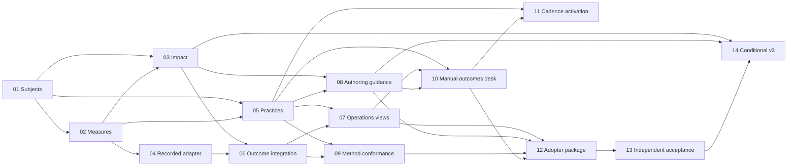

# Continuing operations

Connect enduring user journeys and operational workflows to finite changes, portable
measurements and accountable outcome learning. See the [draft specification](spec.md),
[fourteen proposed brief outlines](proposed-briefs.md), and [cockpit views](cockpit.md).
Tracking: [#1971](https://github.com/medici-finance/assay/issues/1971).

**Parked for design review.** This PR proposes scope; it does not approve the spec or
activate dispatch. The outlines are intentionally not `brief-*.md` execution contracts.
Once merged, the normal generator can list the parked stream on the board, with zero
authored briefs until the follow-on authoring PR lands. No generated central file is
edited here. P2 is a proposed queue priority, subject to the admission decision.

## Briefs

<!-- statusgen:briefs:begin -->
| # | Brief | Wave | Effort | Status | Verified | Reviewed |
|---|-------|------|--------|--------|----------|----------|
<!-- statusgen:briefs:end -->

The generator owns this region. Proposed scopes live in the separate outline document,
not in lifecycle cells. On spec approval, file the strong-tier authoring follow-on in
the same motion. That work converts accepted scopes into independently verifiable
briefs and regenerates this table. Stream activation additionally requires capacity
admission; external dependency holds continue to apply.

## Critical path

The local contract head is O01 (durable journeys and workflows). Measurements and impact
claims need a stable subject before analytics or UI can mean anything. Source review
against main `024c87b01aba8f6c7dd7ccd939e647a9b936be09` found no equivalent enduring
journey/workflow contract; existing execution patterns describe a different concern.
O01 can be specified offline and does not wait for graph runtime delivery.

One longest local path to manual adoption is:
`O01 → O02 → O03 → O06 → O07 → O10 → O12 → O13`.
The optional migration adds `→ O14`. Parallel paths through O04 or O08 are also binding.
Graph-execution prerequisites for O04/O06 may be the actual schedule bottleneck.

**Smallest unblocking move:** agree the subject vocabulary, identity and contract boundary,
then author O01. Starting with a cockpit dashboard or recurring agent would leave it
without reliable subjects, comparable measures or authority-safe execution contracts.

The diagram shows local edges only. The outline table records external graph-execution
owners. No runtime gate is satisfied by this diagram or a proposed wave number.

## Dependency waves

- **Wave 0:** O01.
- **Wave 1:** O02.
- **Wave 2:** O03, O04, O05.
- **Wave 3:** O06, O08.
- **Wave 4:** O07, O09.
- **Wave 5:** O10.
- **Wave 6:** O11, O12.
- **Wave 7:** O13.
- **Wave 8:** O14.

## Milestones and admission

- **Contracts and early authoring:** O01–O05 plus O08. Collect comparable evidence and
  preserve intent before adding automation.
- **Manual learning cycle:** O06/O07/O09/O10. Evaluate recorded outcomes independently;
  use a second profile over the same facts.
- **Portable adopter release:** O12/O13. Independent clean-project fixture exercise;
  runtime automation and cockpit are optional.
- **Separately gated automation:** O11, after the graph recovery/admission/budget owners.
- **Conditional schema migration:** O14 only after the explicit brief-v3 policy decision.

The approving change records the decisions in spec §13. An approved spec still needs
real brief authoring, risk assessment and external prerequisite verification. Delivery
ends at implemented; independent verification remains separate from outcome assessment.
