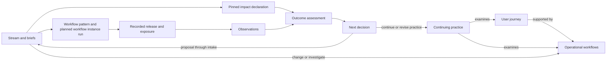
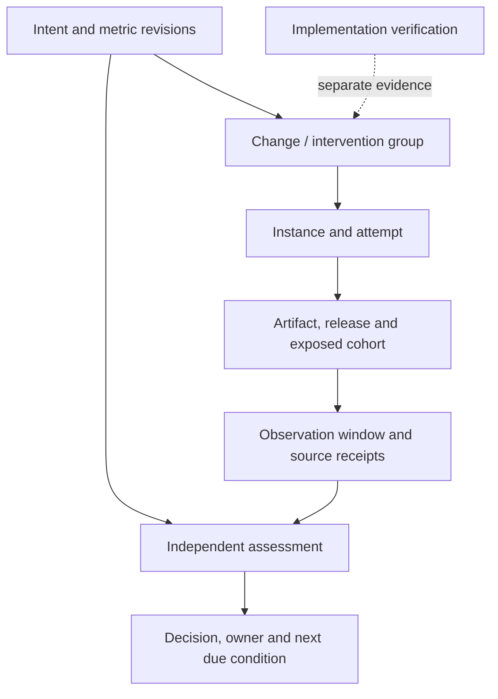

# Continuing operations — journeys, workflow change and outcome learning

**Status:** draft
**Version:** proposal 1, 2026-10-01
**Routes-to:** docs/streams/continuing-operations
**Tracking:** [#1971](https://github.com/medici-finance/assay/issues/1971)

This is a proposed design for review, not an implemented contract or approval to
activate a stream. The [delivery outlines](proposed-briefs.md) identify contract owners,
dependencies and acceptance scenarios. Exact schemas and runnable Verify tables follow
approval. The [cockpit appendix](cockpit.md) describes consumer views and wireframes.

## 1. Problem and intended result

Assay records finite delivery work well. Finishing a brief does not, on its own, answer
whether the user's experience improved, whether a recurring workflow became cheaper or
safer, or who will check again after the delivery stream closes.

The proposal connects enduring user journeys and operational workflows to changes,
predictions, exposure evidence and later assessments. An adopter should be able to ask:

- Which user goal does this workflow support, and where does it hurt today?
- What did this brief expect to change, for whom, by how much and at what cost?
- Was the change delivered, exposed and observed under comparable conditions?
- What did we learn, and who owns the next assessment or decision?
- Can we change our improvement methodology without rewriting the evidence history?

The first useful release is a **manual learning cycle over recorded evidence**. Automation
follows only when identity, evidence quality, ownership and authorization are explicit.
This capability ships through public Assay contracts, skills and adopter scaffolding.

## 2. Concepts and relationships

| Concept | Meaning | Lifetime / owner |
|---|---|---|
| User journey | A user's goal, stages, touchpoints, pain points and success criteria | Endures beyond delivery; accountable journey owner |
| Operational workflow | Recurring work that supports one or more journeys; trigger, steps, handoffs, outputs and boundaries | Versioned operational definition; workflow owner |
| Workflow pattern | Reviewed, versioned shape of a piece of delivery work: nodes, their execution contracts and the gates a risk class requires (`workflow-pattern-v1`) | Existing contract, [`spec/workflow-pattern-v1.md`](../../../spec/workflow-pattern-v1.md); reference implementation `statusgen patterns` ([graph-execution/02](../graph-execution/brief-02-pattern-schema-and-node-contract.md)) |
| Workflow instance | A workflow pattern bound to one change's subject, Cell and acceptance (`workflow-instance-v1`) | Planned by [graph-execution/09](../graph-execution/brief-09-instance-contract.md) (`spec/workflow-instance-v1.md` (planned)); not yet implemented |
| Practice | Continuing responsibility for examining a subject and acting through existing decision channels | Practice owner and separately assigned evaluator |
| Stream / brief | Finite delivery work changing or investigating an enduring subject | Existing Assay delivery lifecycle |
| Impact declaration | Preserved intent and predicted effects of a change | Authored before exposure; pinned for assessment |
| Observation / assessment | Recorded evidence / an interpretation of that evidence | Separate provenance, version and authority |

"Operational workflow" is the adopter-facing term for recurring operational work. It
is not the existing `workflow-pattern-v1` contract, which describes how Assay executes a
piece of delivery work, and not graph-execution/09's planned `workflow-instance-v1`,
which binds such a pattern to one change. The three share the word "workflow"; §13
records that collision and the recommended qualifier. A journey can span several
operational workflows; an operational workflow can serve several journeys. Their
identities must remain distinct. A practice can apply to either or both. An internal delivery journey is valid,
but the model must also represent a product user's journey.



## 3. User journeys to support

| Actor and trigger | Steps | Observable completion |
|---|---|---|
| Journey owner sees repeated user friction | Declare goal and touchpoints → link supporting workflows → select outcome and guardrail metrics → record baseline gaps | Another reader can trace the goal to its evidence and accountable owner |
| Brief author proposes a workflow change | Link affected subjects → state mechanism and uncertainty → predict a measurable effect or give an honest non-prediction disposition → name evaluator and trigger | Intent is reviewable before work starts and cannot be silently rewritten after results arrive |
| Independent evaluator reaches the observation window | Check exact version/exposure → inspect coverage and confounders → assess expectation and guardrails → record continue/investigate/propose-change/escalate | An inconclusive or adverse result remains visible and has a next owner |
| Operator changes methodology | Preview input coverage → replay a second profile → review interpretation and policy differences separately → approve scoped profile binding | Original facts and past decisions retain their identities and original interpretation context |
| New adopter starts without a cockpit or scheduler | Install optional files → import recorded fixture evidence → generate Operations → perform one manual assessment | Entire cycle works locally with documented capabilities and no private services |
| Stream owner closes delivery work | Complete normal verification → transfer any due assessments to the continuing practice | Journey, workflow and evaluation obligations survive stream archival |

## 4. Durable records and one-writer projections

Proposed source layout (exact formats are deliverables of outlines 01–06):

```text
docs/operations/
  journeys/<id>.yaml
  operational-workflows/<id>.yaml
  practices/<id>.yaml
  metrics/<id>.yaml
  assessments/<id>.yaml
docs/streams/<stream>/brief-<NN>-<name>.md
OPERATIONS.md                         # generated summary, never a shared write target
```

The layout stores definitions and low-volume assessment records, not unbounded raw
telemetry. Large or sensitive evidence stays in permissioned source storage; records
carry bounded references, digests, availability and retention metadata. Run, instance
and lifecycle records use their existing owners' canonical storage/envelopes.

Every object needs a stable globally unique ID, kind, schema version, revision, owner,
scope and explicit typed references. Names and paths can change without changing ID.
Retirement preserves references and history; a stream closing cannot retire a journey.
References resolve kind and pinned revision, not just a matching filename. Cross-repo
resolution uses declared registries and existing access boundaries; unavailable differs
from nonexistent, and inaccessible evidence cannot support a positive conclusion.

Each new assessment is its own record. Competing edits to one definition use normal
reviewed revision control; unique record IDs prevent unrelated evaluations contending
on a shared log. Duplicate source IDs are deduplicated; divergent content under the same
identity is a conflict to resolve, not last-writer-wins evidence.

`statusgen` will derive Markdown and a versioned JSON projection from the same evaluator.
Each destination has one publisher. A generation manifest pins input revisions/digests,
cutoff/watermark, evaluator version and visibility scope. Publication is atomic and
rejects stale generations; sorting and replay are deterministic. CLI and cockpit display
the same facts, gaps and freshness. Neither edits an aggregate to change state. Central
indexes, due queues and summary counts are derived. No new multi-writer `STATUS.md`-like
source file is introduced.

## 5. Portable measurements before methodology

Collect a bounded common core because several methods need the same evidence. Do not
collect everything on the assumption that some future method might use it.

| Evidence family | Examples | Required interpretation context |
|---|---|---|
| User outcomes | Goal completion, abandonment, time to user value | Journey stage, cohort, denominator, exposure and observation window |
| Flow | Arrival, start, completion, service time, wait time, rework and handoffs | Operational workflow revision, queue boundaries and measurement coverage |
| Effort and cost | Human effort, compute usage, collection and evaluation cost | Units, accounting source, scope and missing categories |
| Quality and guardrails | Defects, failures, retries, reversals and selected safety/service constraints | Severity definition, exposure denominator and agreed limits |
| Evidence health | Coverage, lag, missing/duplicate/conflicting receipts | Source identity, instrument version, freshness and uncertainty |

A metric definition specifies ID/revision, meaning, units, aggregation, numerator and
denominator where relevant, direction, source instrument, sampling, cohort/window and
retention rules. Values bind those definitions and include timestamps, provenance and
quality state. Missing is not zero; unknown is not success. Incompatible units, cohorts,
environments or definition revisions cannot be silently pooled. Comparable segmented
views should accompany totals where composition changes could reverse the conclusion.

The collection policy must declare allowed fields, sensitivity, storage/access scope,
sampling ceiling, retention/deletion behavior and collection budget. No raw transcript
or personal payload is required. Public examples are synthetic. A measurement gap is a
valid outcome; extending collection requires its own scoped decision and cost.

Reuse existing flow instruments where their definitions match. Start with recorded
files/receipts and manual import; production queries and vendor adapters are separate
adopter choices. A missing instrument is shown as a gap, not inferred from activity.

## 6. Brief impact declarations and compatibility

Add an **Expected impact** area to authoring: a concise human explanation backed by a
validated optional `change-impact-v1` extension for brief-v2. Proposed contents:

| Field group | What it preserves |
|---|---|
| Subjects | Journey, operational workflow and practice IDs and revisions affected, including indirect effects |
| Hypothesis | Problem, proposed mechanism, assumptions and uncertainty |
| Expectations | Metric definition, baseline or baseline gap, anticipated direction/range, cohort, window, guardrails and evaluation rule |
| Follow-through | Evaluation owner, trigger/deadline, exposure requirement, evidence references and next-decision route |

Disposition is explicit: `predicted`, `learning`, `enabling`, `no-direct-impact`, or
`unrecorded` for historical work. Learning work can succeed as delivery while disproving
its hypothesis. Enabling work names the downstream capability; no-direct-impact work
explains why no direct metric claim is appropriate. Do not manufacture numeric targets
to satisfy a form. Success criteria should be fixed before inspecting the result;
exploratory analyses are labelled as such.

Preserve the existing meanings of `measures` and `outcome`; do not overload them.
Unknown-key tolerance in the current schema is not support for this extension.
Outline 03 must implement schema/parser/semantic validation parity and capability
reporting. Tooling that lacks required semantics must report unsupported capability,
not quietly ignore impact obligations. Until that exists, this draft authorizes no new
frontmatter claims of support. Enforcing required impact across all new briefs would
require the separate brief-v3 policy decision and migration in outline 14.

At approval/exposure, bind the exact brief revision and impact digest. Any material
edit creates a new revision; an old assessment keeps the original snapshot. Implemented,
verified and done retain their delivery meanings. Outcome assessment is a separate
dimension: a done brief may be unexposed, awaiting observation or inconclusive.

## 7. Evidence chain, evaluation and attribution

Extend the existing lifecycle-link owner rather than invent a second outcome ledger:



Assessments name observed changes, prediction agreement, guardrail outcomes, uncertainty,
evidence coverage and alternative explanations. Preserve null and adverse findings.
Distinguish unexposed, exposed-unobserved, insufficient evidence, observed-inconclusive
and observed-result. Refuse wrong artifact, version, environment or cohort joins.
Late/corrected evidence produces a superseding assessment; prior decisions remain
auditable against what was known then.

Linkage supports attribution analysis; it does not establish causation. A release
containing several briefs is an intervention group unless independent exposure or an
appropriate experimental design supports finer separation. Before/after comparisons
must disclose seasonality, traffic mix, concurrent changes and other confounders.
Randomized or other stronger designs are optional and require adopter authorization.
Do not turn a correlation or a confidence label into causal credit for each brief.

Outcome evaluation has an accountable evaluator distinct from the implementer's claim.
Reusing an existing desk is acceptable; self-verification is not. Evaluation evidence
does not confer release, rollback or policy-changing authority.

## 8. Practices, profiles and an OODA-style loop

A practice declares subject bindings, owner, review trigger/cadence, observation window,
deadline, interpretation profile and escalation route. Its optional profile defines
input requirements and interpretation rules. The permission/admission policy is a
separate versioned reference controlled through existing governance.

| Loop activity | Record and responsibility |
|---|---|
| Observe | Collect scoped measurements and evidence-quality state |
| Orient | Interpret through a declared profile; record context and uncertainty |
| Decide | Record continue, investigate, propose-change or escalate with owner/reason |
| Act | Route approved work through existing intake, brief and execution mechanisms |

This supports OODA-style review and bounded PDSA experiments without making either
mandatory. Cynefin is one optional interpretation profile. A Cynefin classification is
a contextual judgment with assessor, time, rationale and confidence; metrics alone do
not determine a domain or permission to act. Domain, reversibility, blast radius,
observability and uncertainty can inform a change approach, but cannot override gates.

Prove portability using Cynefin and a bounded flow-improvement profile over identical
records. Preview missing inputs, cost and historical comparability before switching.
Shadow/replay the new profile, preserve prior assessments under their original versions,
and approve a scoped effective date with rollback. Changing a display lens cannot
change a cadence, permission or operational policy. New evidence collection needs an
explicit separate change. Cheap switching means avoiding data rewrites; it does not
promise every methodology can operate on every existing dataset.

## 9. Outcomes responsibility and cadence

Introduce a logical **outcomes-desk responsibility**, initially carried by an existing
desk or human. It owns due assessments, evidence sufficiency, independent evaluation,
next decisions and continuing follow-through. It does not duplicate intake, worker,
review or verification responsibilities, and does not require a new standing service.

Manual operation comes first. Outline 11 later binds cadence to existing recovery,
instances, admission and budget contracts. A logical occurrence needs stable identity
across retries, coalesced triggers, deadlines, missed-window policy, claims, cancellation,
recovery and cumulative cost accounting. Observation windows must distinguish event
time from ingestion time. Stale data can produce an overdue/gap escalation, not an
invented positive assessment or automatic intervention.

No new scheduler, graph database, autonomous remediation authority or policy learner is
part of this proposal. Repeated checks alone are not improvement. Each occurrence must
leave evidence, an honest disposition and an accountable next step.

## 10. Existing owners and planned contracts

Source inspection: public main `024c87b01aba8f6c7dd7ccd939e647a9b936be09`,
2026-10-01. Dependency references below describe ownership, not proof of completion;
refresh the generated board and acceptance evidence before authoring or dispatch.

| Surface | Existing owner / proposed change |
|---|---|
| Journey/operational workflow identity | New `spec/operational-subject-v1.md` (planned) + matching schema, outline 01; a separate kind from the two workflow contracts below |
| Workflow pattern | Existing [`spec/workflow-pattern-v1.md`](../../../spec/workflow-pattern-v1.md) + `schemas/workflow-pattern-v1.json`, `statusgen patterns` ([graph-execution/02](../graph-execution/brief-02-pattern-schema-and-node-contract.md)); consumed unchanged, never extended with operational subjects |
| Measurements | New `spec/measurement-v1.md` (planned) + matching schema, outline 02; reuse [graph-execution/07](../graph-execution/brief-07-flow-instruments.md) instruments |
| Expected impact | New `spec/change-impact-v1.md` (planned) + matching schema, outline 03; compatible extension of [brief-v2 schema](../../../schemas/brief-v2.json) |
| Practices/profiles | New `spec/improvement-practice-v1.md` (planned) + matching schema, outline 05; policy authority remains separate |
| Run/receipt/replay envelope | [graph-execution/06](../graph-execution/brief-06-run-records-and-replay.md), consumed by outlines 04 and 06 |
| Workflow instance / work-input identity | Planned `workflow-instance-v1` from [graph-execution/09](../graph-execution/brief-09-instance-contract.md) and the [work-input amendment](../graph-execution/work-input-amendment.md), consumed by 06 and 11 |
| Release/exposure/outcome links | [graph-execution/17](../graph-execution/brief-17-lifecycle-links.md), compatibly extended by 06 |
| Cadence execution boundary | [04 recovery](../graph-execution/brief-04-recovery-contract.md), [14 admission/dispatch](../graph-execution/brief-14-admission-dispatch-binding.md), [16 budgets/ownership](../graph-execution/brief-16-cell-ownership-budgets.md), consumed by 11 |
| Operations projection | `statusgen`, outline 07; read-only versioned consumer contract for CLI/cockpit |
| Decision assessment | Existing [`spec/decision-assessment-v1.md`](../../../spec/decision-assessment-v1.md) ([graph-execution/10](../graph-execution/brief-10-decision-contract.md)) assesses a proposed decision before it is taken. The outcome assessment here judges observed evidence after exposure; outline 06 keeps them separate kinds and does not reuse the word unqualified |
| Requirement register | Existing [`spec/registers-v1.md`](../../../spec/registers-v1.md) §6, which a brief's `outcome:` key already points at. A journey's success criteria describe an enduring user goal, not one recorded ask; outline 01 links a journey to requirement IDs rather than copying their acceptance criteria |
| Authoring and adoption | Public author-brief guidance, templates and install/adopt bundle, outlines 08 and 12 |

Those four new contracts are proposed deliverables, not files this PR claims exist.
If an upstream contract changes before implementation, update its consumer brief and
compatibility tests, not an independent shadow envelope. Cross-stream prerequisites
must become typed dependency edges in the executable briefs. No upstream lifecycle
cell or completion claim is changed by this proposal.

## 11. Cockpit integration

Retain the adopter's existing shell and navigation. Add a durable Operations entry and
subject links beside Streams, with views for journey, workflow, impact, outcome, cadence
and profile comparison. Each view shows provenance, capability, freshness, gaps, owner
and next action. The [seven wireframes](cockpit.md) specify these states and seams.

Read surfaces consume the shared projection; UI must not reimplement its evaluator.
Authoring routes to reviewed source changes. A future permitted action uses an existing
typed command and rechecks capability/authorization at its execution boundary. Hiding
a button is not a security boundary. A projection or profile selection never grants
write access. Unavailable data and absent permissions have distinct visible states.

Actual cockpit delivery belongs to its client repository's existing projection and
room owners. Two proposed consumer slices are scoped in the appendix: subject/impact/
outcome navigation after 07; cadence and profile comparison after 09/11. Their runnable
briefs are prerequisites for client rollout, not extra public runtime implementations.
The CLI/manual adopter milestone remains usable without a cockpit.

## 12. Acceptance and staged rollout

1. Review definitions, authority boundaries and decisions below; keep this stream parked.
2. Author accepted outlines into full briefs with actual paths, typed dependencies,
   derived risk gates, design-fit, consumer mapping and runnable Verify tables.
3. Ship subjects → measurements → optional impact/practices, then one recorded adapter.
4. Integrate canonical lifecycle links and generate Operations. Train authoring/review
   guidance early, once 03/05 exist; do not wait for a scheduler.
5. Exercise manual outcomes review and a second methodology over the same evidence.
6. Ship optional adopter scaffolding and independent clean-project acceptance. Cadence
   automation is a separately gated branch and is not a prerequisite for manual adoption.
7. Decide whether to require impact on new briefs through brief-v3 only after that exercise.

| Acceptance case | Required observation |
|---|---|
| Product and delivery journeys | Same contracts express both, with distinct user goals |
| Rename/archive | IDs and pending assessments survive rename and stream closure |
| Wrong evidence | Wrong-version, wrong-cohort and unavailable source cases cannot produce a supported result |
| Multi-brief release | Combined exposure does not create invented per-brief causal credit |
| Adverse/inconclusive result | Delivery may be complete while outcome remains adverse or unresolved with an owner |
| Concurrent producers | Separate records, deterministic replay and stale-publish refusal; no shared append file |
| Method switch | Original facts/predictions retain IDs; old assessments retain profile versions; gaps visible |
| Clean adopter | Manual full cycle works without a hosted backend, cockpit or scheduled agent |
| Cadence restart | One logical occurrence across duplicate triggers/crash; budget and authority survive restart |
| Migration | Mixed versions follow declared capability policy; no invented historical prediction |

Measure the rollout itself: time to author an impact declaration, missing/usable evidence
rate, collection/evaluation cost, overdue assessment rate, method-switch rework and
independent adopter completion. Set numeric success thresholds with the first measured
baseline; do not invent promised savings. Fixture acceptance proves portability and
contract behavior. Real-world effectiveness requires an explicitly authorized adopter
pilot with comparable exposure and enough evidence to support its conclusions.

## 13. Decisions requested before activation

| Decision | Recommended starting point | Consequence / owner of follow-through |
|---|---|---|
| Terminology and source home | Journeys, operational workflows and practices under `docs/operations`. **Collision:** "workflow pattern" (`workflow-pattern-v1`, graph-execution/02) and "workflow instance" (planned `workflow-instance-v1`, graph-execution/09) already name delivery-execution contracts. Recommended: keep "operational workflow" but qualify it everywhere it is a contract term (record kind `operational-workflow`, directory `operational-workflows/`, "operational workflow revision"). Never use a bare "workflow", "workflow version" or "workflow instance" for the new kind, and always cite pattern/instance references by contract ID. Renaming the kind (for example "operating routine") is the alternative if reviewers prefer no shared word | Approve 01/05 contract authoring; O11's adapter produces `workflow-instance-v1` instances of a workflow pattern, never instances of an operational workflow |
| Minimum impact policy | Optional validated brief-v2 extension first; retain honest dispositions | 03/08 authoring; 14 stays conditional |
| Methodology commitment | Bounded common evidence core; Cynefin and flow profiles optional | 02/09 define supported coverage, not universal collection |
| Continuing accountability | Existing desk/human hosts outcomes responsibility with independent assessment | Name adopters' role bindings in 10/12 |
| Initial delivery boundary | Recorded evidence and manual review before automated cadence | Manual adoption need not wait for graph dispatch/budget work |
| Stream admission | Parked until approval and capacity decision | Approving PR files the author-brief follow-on; activation does not bypass dependency holds |

Merge of a draft proposal does not approve these decisions. Record approval explicitly;
the approving change must file the authoring follow-on in the same motion. Full brief
authoring can split any L-sized outline further after interface review. No execution
gate is preselected by this outline set.

## 14. Research informing the design

These sources motivate choices; they do not certify the proposed implementation:

- [IHI measurement guidance](https://www.ihi.org/library/model-for-improvement/establishing-measures)
  distinguishes outcome, process and balancing measures; this proposal combines
  predictions with guardrails and evidence quality rather than one activity score.
- [IHI testing changes](https://www.ihi.org/library/model-for-improvement/testing-changes)
  informs bounded learning cycles and explicit predictions before examining results.
- [Google SRE: implementing SLOs](https://sre.google/workbook/implementing-slos/)
  informs user-relevant indicators and accountable review; service health alone does
  not stand in for every user outcome.
- [Cynefin origins](https://thecynefin.co/part-five-origins-of-cynefin/)
  informs contextual sense-making; the profile is optional and does not derive context
  mechanically from delivery counts.
- [Microsoft online experimentation](https://www.microsoft.com/en-us/research/publication/online-experimentation-at-microsoft/)
  informs the distinction between observed change and supported causal inference.
- [OMG BPMN 2.0.2](https://www.omg.org/spec/BPMN/2.0.2/About-BPMN)
  provides related process-modeling vocabulary. This proposal does not require a BPMN
  engine or claim BPMN conformance.
