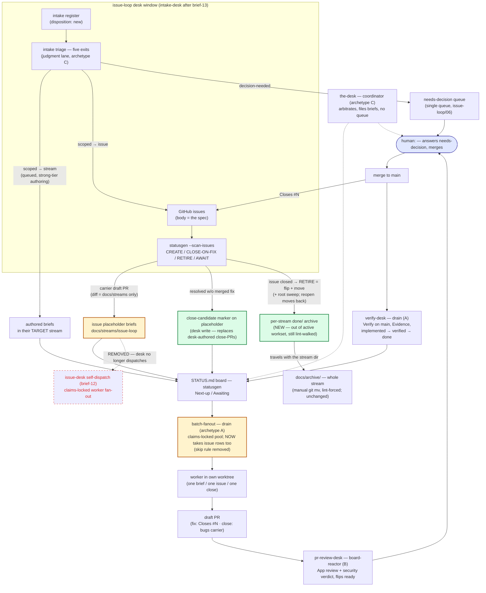

# Brief 14 — Desk emits briefs, not PRs + per-stream `done/` archive

## Context

files:
- `../oit/.claude/skills/intake-desk/SKILL.md` — remove the self-dispatch lane; desk output = briefs only
- `../oit/.claude/skills/batch-fanout/SKILL.md` — remove the issue-placeholder skip rule; absorb issue dispatch
- `../assay-toolkit/statusgen/scanissues.go` — RETIRE moves the placeholder to `done/`; reactivation checks `done/`; root sweep
- `../assay-toolkit/statusgen/placeholder.go` — optional `close-candidate:` frontmatter field (parse + lint + Next-up marker)
- `../assay-toolkit/statusgen/checks.go` (or a sibling) — two ADDITIVE checks for the `done/` convention
- `../oit/docs/loop-engine-architecture.md` §3 + `docs/streams/loop-engine/brief-03-issue-loop-dispatch-lane.md` — rescope notes
- `CLAUDE.md` (Bug tracking) + `docs/streams/issue-loop/README.md` — convention text
- docs/streams/findings/2026-07-20-issue-desk-emits-briefs-not-prs.md — flip `resolved: yes` when this lands

facts (current mechanics, investigated 2026-07-20 @ 60b41a56):
- **The desk writes PRs three ways today.** (1) Scan-carrier draft PRs (`../oit/.claude/skills/intake-desk/SKILL.md` "The loop — issue lane" step 1: `gh pr create --draft` per scan). (2) **Self-dispatch** (step 2, brief-12): the desk claims `issue-loop--issue-<NN>.claim` and fans out its own workers, whose PRs it originated; batch-fanout explicitly SKIPS `issue-loop/issue-*` rows (`../oit/.claude/skills/batch-fanout/SKILL.md` "Also EXCLUDE issue-placeholders"). (3) The `bugs/<N>.md` close-PR flow (issue-loop/10, CLAUDE.md § Bug tracking) — a reviewed close is itself a PR.
- **RETIRE is in-place.** The scanner flips a closed issue's placeholder to `status: done` + `resolved: issue-close` (`../assay-toolkit/statusgen/scanissues.go`, closeOutPlan) but the file stays at the stream root forever — hence the 52 ghosts.
- **Archival today is whole-stream only, manual, lint-forced.** `../assay-toolkit/statusgen/checks.go:39` PROBLEMs a `status: done` stream until someone hand-runs `git mv docs/streams/<stream> docs/archive/`. No mover tool exists. `docs/archive/` is entirely outside statusgen: stream discovery reads only `docs/streams/*/README.md` (`../assay-toolkit/statusgen/load.go:99-131`) and linkcheck walks only `docs/streams/` + CLAUDE.md.
- **A `done/` subfolder is invisible to discovery by construction.** Brief discovery globs `<stream>/brief-*.md` and placeholder discovery globs `<stream>/issue-*.md` at the stream ROOT only — nothing under a subdirectory enters briefs, placeholders, Next-up, or the board. Linkcheck's recursive walk DOES cover it, so archived files stay dead-link-checked and any README link to a moved file must be re-pointed.
- **The transient-prune precedent is `../oit/tools/bugs-gc/main.go`**: daily, `gh`-backed, DELETES `bugs/<N>.md` carriers whose issue is CLOSED. It stays untouched — it deletes GitHub-duplicated carriers; `done/` PRESERVES in-repo work records until whole-stream archival (human:<name>: "out of the active workset but not lost").
- **`docs/streams/intake/` and `docs/streams/findings/` are reserved REGISTER dirs** (`../assay-toolkit/statusgen/load.go:16-19`) — they are skipped by stream discovery and cannot host briefs.
- **Loop-engine interplay** (`../oit/docs/loop-engine-architecture.md` §3): issue-DISPATCH lane is drain archetype A with its own planned engine consumer (loop-engine/03); this brief removes that lane, so 03 rescopes (its select folds into batch-fanout's engine consumer, loop-engine/02).

## Design decisions (the "figure it out" answers)

**D1 — Home for issue/intake-driven briefs: `docs/streams/issue-loop/` (this stream; becomes `intake-desk` when brief-13 lands).** Reasons: (a) `docs/streams/intake/` is a reserved register dir — statusgen cannot host briefs there by construction; (b) issue placeholders ALREADY live here and already flow through Next-up — the home requires zero migration and no new stream; (c) intake entries triaged `scoped → <stream>` keep landing their authored briefs in the TARGET stream (existing convention — those follow the target stream's normal lifecycle). Only **issue-keyed transients** (placeholders, close-candidates) live here and get the transient archival lifecycle.

**D2 — The desk emits briefs, never PRs-as-product.** The desk's outputs become exactly: placeholder briefs (scanner), triage dispositions + queued authored briefs, `needs-decision` issues, labels/comments, and CLOSE-ON-FIX issue closes (an issue-state action, not a PR). Its repo writes land via a **carrier branch + draft PR whose diff is confined to `docs/streams/**`** (brief/placeholder/register files) — the carrier is transport for briefs, not work product. It never dispatches workers (brief-12 superseded; claims lane and skip rule removed) and never authors implementation or close PRs. Dispatch of issue placeholders returns to **batch-fanout** via the normal Next-up path.

**D3 — Archival = per-stream `done/` subfolder, moved by the scanner's RETIRE, triggered by issue-close.** human:<name>'s proposed shape is adopted as-is because statusgen already gives it the right semantics for free: root-only discovery globs mean `<stream>/done/` is out of the active workset with **zero exclusion code**, while linkcheck's recursive walk keeps it lint-valid. RETIRE becomes flip-frontmatter AND `git mv` to `done/` in one scan write; the same run sweeps any already-retired file found at root (drains the 52-ghost backlog on first run, self-heals after). Reactivation (issue reopens) checks `done/` first and moves the file back with `status: todo`. Rejected alternatives: a new mover tool (RETIRE already owns the lifecycle flip — same write, no second tool); extending bugs-gc (it deletes GitHub-duplicated carriers; placeholders are in-repo records to preserve). Composition with whole-stream archival: unchanged — when a stream completes, the manual `git mv` to `docs/archive/` takes `done/` with it. The mechanism is **generic**: any stream MAY move a `status: done` brief file to `<stream>/done/`, re-pointing its README row link to `./done/…` (the row STAYS — the table remains the record); mandatory only for issue-loop's issue-keyed transients.

**D4 — The `bugs/<N>.md` close-PR flow (issue-loop/10) is KEPT, not replaced — but re-authored.** It solves a different problem (reviewed AUTHORIZATION to close an issue no merge would close: FIXED-NOT-CLOSED / WONTFIX / DUPLICATE / STALE) than `done/` (board hygiene after the close). They compose: fix-PR merges with `Closes #N` → issue closes → next scan retires + archives the placeholder. For no-merge closes, the desk marks the placeholder `close-candidate: <verdict>` — a brief write — which keeps the row in Next-up as work whose deliverable IS the close-PR; a batch-fanout worker authors `bugs/<N>.md` + `Closes #N`, review judges the claim, merge closes, scan archives. The desk itself never opens the close-PR.

## The pipeline DAG (as-built, with this brief's changes marked)

Scope: the core process/pipeline system. (If the DAML/product core — templates + agents + flows —
was wanted instead, that renders as a separate follow-up diagram; say so and it gets its own doc.)
Legend: red-dashed = removed by this brief · green = added · amber = changed.

## Ground rules
- NEVER git push to main / trigger workflows / run mutating kubectl. Branch + draft PR; stop at `implemented` — you do not set verified/done.
- **Do NOT touch `../assay-toolkit/statusgen/registers.go`** (tombstone/anti-falsification guard — human-gate surface). New checks are additive and live outside it.
- **brief-13 rename is orthogonal**: implement against whatever name is on main at pickup (`issue-loop` or `intake-desk`); if a rename PR is in flight on the same paths, sequence behind it (NEEDS_CONTEXT over a collision).
- The claims-key convention (`issue-loop--issue-<NN>.claim`) is UNCHANGED — only its holder moves (batch-fanout instead of the desk).
- No attribution lines anywhere. If anything contradicts repo state, report NEEDS_CONTEXT, don't guess.

## Task
1. **`../oit/.claude/skills/intake-desk/SKILL.md`** — remove the DISPATCH step (self-dispatch lane, brief-12) and the desk-side claims instructions; state the desk's output contract (D2): briefs only, carrier PRs confined to `docs/streams/**`, never implementation/close PRs, never dispatch. Keep the scanner, CLOSE-ON-FIX, AWAIT visibility, decision issues, intake triage. Document the `close-candidate` write (D4) and the RETIRE→`done/` behavior (D3).
2. **`../oit/.claude/skills/batch-fanout/SKILL.md`** — delete the "EXCLUDE issue-placeholders" skip rule; issue rows dispatch like any Next-up row (claims key unchanged). Fold in the issue-worker prompt conventions the issue-loop skill carried (issue body = spec, own worktree, park-question protocol, `Refs`/`Closes` rule) and the close-candidate variant (deliverable = `bugs/<N>.md` close-PR per issue-loop/10).
3. **`../assay-toolkit/statusgen/scanissues.go`** — RETIRE = flip frontmatter (`status: done` + `resolved: issue-close`) AND move the file to `<stream>/done/`; same run sweeps any `status: done` placeholder found at the stream root; reactivation checks `done/` and moves the file back with `status: todo`. `--dry-run` prints the moves. Unit tests: retire-moves, sweep-moves, reopen-moves-back (fixture-driven, no live `gh`).
4. **`../assay-toolkit/statusgen/placeholder.go`** — optional `close-candidate: <FIXED-NOT-CLOSED|WONTFIX|DUPLICATE|STALE>` field: parse, lint unknown values as PROBLEM, render a `[close]` marker on the Next-up row. Tests included.
5. **Additive lint checks** (in `../assay-toolkit/statusgen/checks.go` or a sibling file, NOT `../assay-toolkit/statusgen/registers.go`): NOTICE when a `status: done` + `resolved:` placeholder sits at a stream ROOT ("archive candidate — run the scan"); PROBLEM when any brief/placeholder file under a `done/` subfolder has a non-done status (no parking active work out of sight). Tests included.
6. **Run the sweep once** and commit the moves: all currently-retired `docs/streams/issue-loop/issue-*.md` ghosts move to the new `done/` folder in this PR.
7. **Docs ripples**: CLAUDE.md § Bug tracking — close-PRs are authored by pipeline workers off a `close-candidate` row, the desk emits briefs only (keep within the 2850-word budget); `docs/streams/issue-loop/README.md` — record D1–D4 + the `done/` convention; `../oit/docs/loop-engine-architecture.md` §3 — issue-DISPATCH lane row folds into batch-fanout's drain; `docs/streams/loop-engine/brief-03-issue-loop-dispatch-lane.md` — rescope note pointing at issue-loop/14 and F-desk-emits-briefs; flip that finding `resolved: yes` in the same PR.

## Verify (executable — no prose-only DoD items)
| # | Command | Expect |
|---|---------|--------|
| 1 | `grep -ci "EXCLUDE issue-placeholders" .claude/skills/batch-fanout/SKILL.md` | prints `0` (skip rule gone) |
| 2 | `grep -ci "Dispatch one worker per claimed issue" .claude/skills/intake-desk/SKILL.md` | prints `0` (self-dispatch lane gone) |
| 3 | `grep -qi "close-candidate" .claude/skills/batch-fanout/SKILL.md && grep -qi "close-candidate" .claude/skills/intake-desk/SKILL.md; echo $?` | prints `0` (both sides document the lane) |
| 4 | `(rc=0; for t in Retire Sweep Reactivat CloseCandidate; do out=$(go test ./statusgen/ -count=1 -run "$t" -v 2>&1); tr=$?; { [ $tr -eq 0 ] && printf '%s' "$out" \| grep -q -- '--- PASS'; } \|\| { echo "MISSING-OR-FAIL $t"; rc=1; }; done; exit $rc)` | exit 0, prints nothing — each of the four named test groups EXISTS and passes (a bare `-run` that matches nothing exits 0 with "no tests to run", so existence must be asserted from `--- PASS`). Tests assert retire moves to done/, root sweep moves, reopen moves back, close-candidate parses/lints. Exit status is captured (`tr=$?`) and asserted BEFORE the `--- PASS` check, so a FAILING test in the group also goes red — the previous pipeline form discarded `go test`'s status and passed on a red suite. **RED at 2026-08-03: `MISSING-OR-FAIL CloseCandidate`, rc=1** — and correctly so. This brief is `todo`; the `close-candidate:` frontmatter field is Task/D4, unbuilt (`grep -rn 'close-candidate' --include='*.go' .` → **0**, against a control of 28 files matching `func main`), so no test can be named for it yet. Measured per group: `Retire` 8 `--- PASS`, `Sweep` 1, `Reactivat` 5, `CloseCandidate` **0**. The row is not retuned to drop the missing token — three-of-four green with the fourth loudly named is the row doing its job. It goes green when the brief lands; the previous `\|`-alternation form matched no test name at all and passed having run nothing |
| 5 | `grep -l "status: done" docs/streams/issue-loop/issue-*.md 2>/dev/null \| wc -l` | prints `0` (root ghost backlog swept) |
| 6 | `ls docs/streams/issue-loop/done/ \| wc -l` | ≥ 50 (the swept ghosts live in done/) |
| 7 | `statusgen --root . --lint; echo "lint-exit=$?"` | `lint-exit=0`; no PROBLEM mentions `done/` |
| 8 | `statusgen --root . >/dev/null && grep -c "issue-loop/done" STATUS.md; git checkout -- STATUS.md 2>/dev/null \|\| true` | prints `0` (archived briefs absent from the generated board; STATUS.md not committed) |
| 9 | `git diff origin/main -- tools/statusgen/registers.go \| wc -l` | prints `0` (tombstone/integrity guard untouched) |
| 10 | `grep -qi "issue-loop/14" docs/streams/loop-engine/brief-03-issue-loop-dispatch-lane.md && grep -q "resolved: yes" docs/streams/findings/2026-07-20-issue-desk-emits-briefs-not-prs.md; echo $?` | prints `0` (rescope note + finding resolved) |
| 11 | `grep -qi "close-candidate" CLAUDE.md; echo $?` | prints `0` (CLAUDE.md documents the re-authored close flow) |

## Evidence
<!-- one row per Verify item, filled at verify time by a non-implementer. -->

## Review
Gate: model. Reviewer records verdict + date in the issue-loop README table.
