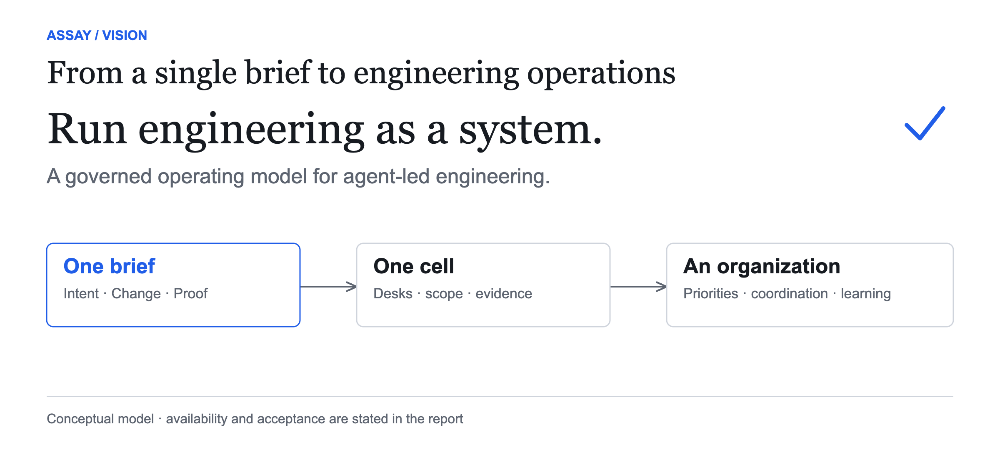
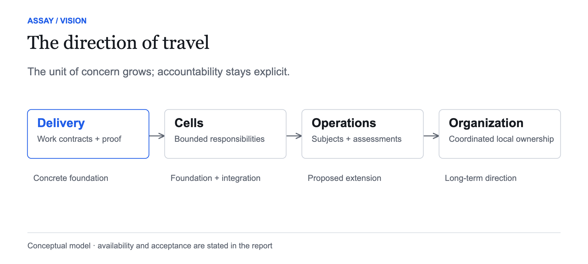
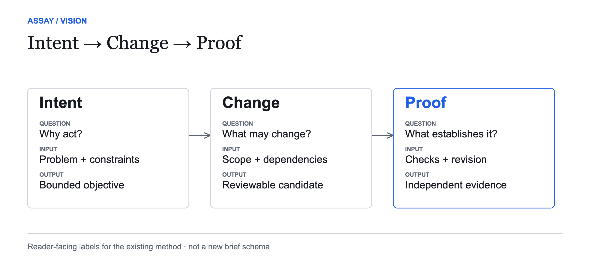
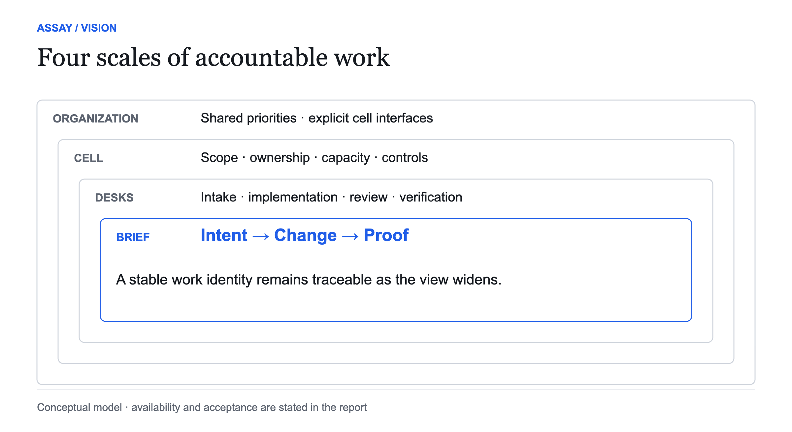
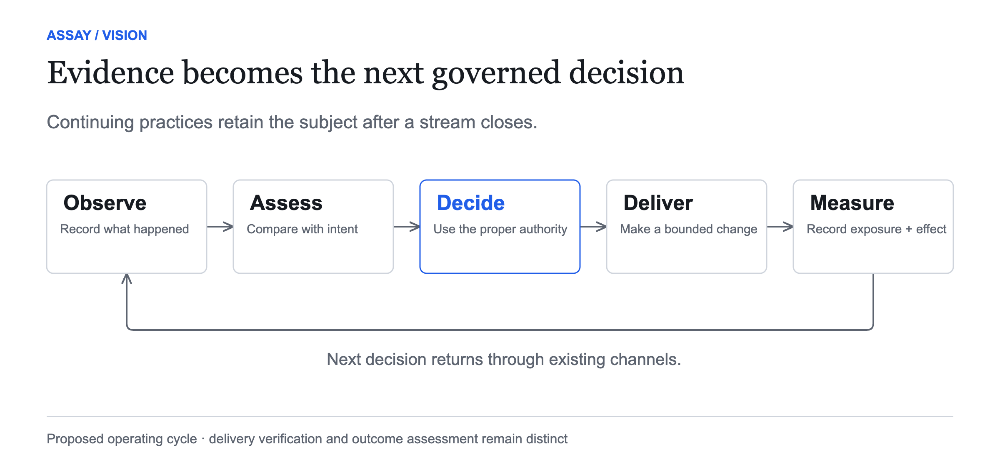
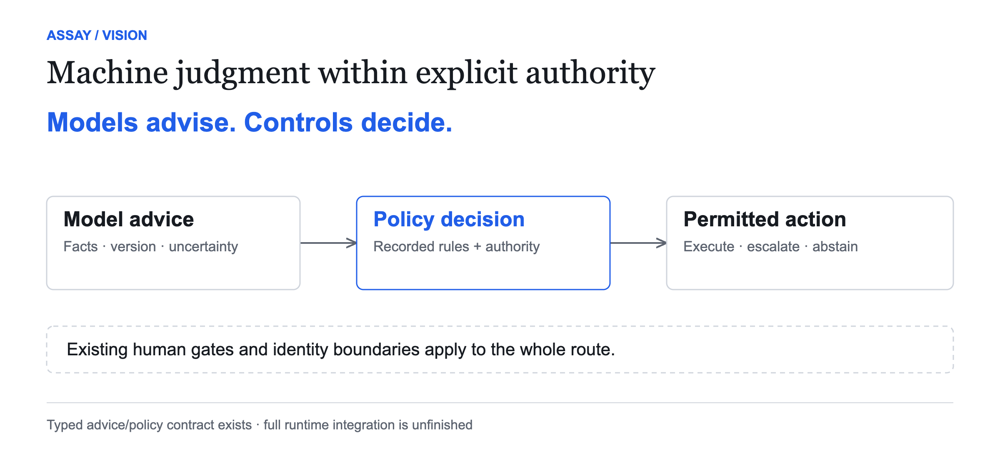
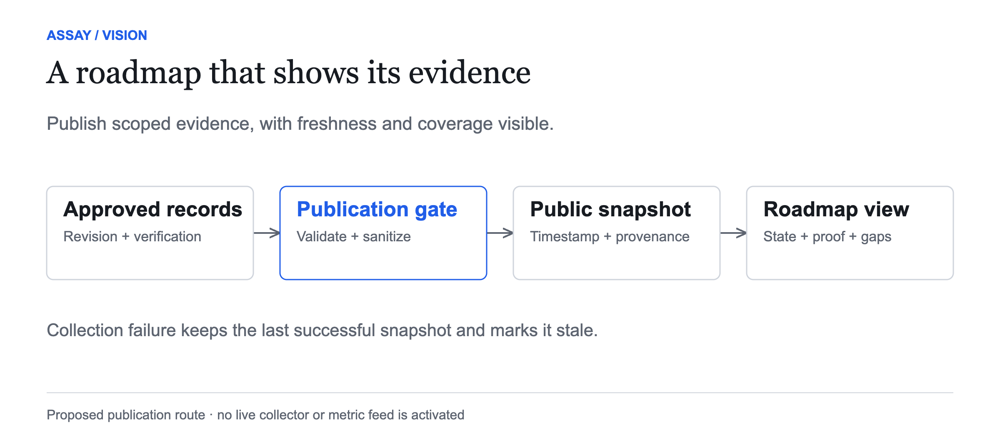

# Assay: from governed delivery to engineering operations

**A governed operating model for agent-led engineering.**

> an agent-operated delivery pipeline with a human-governance layer



**Vision report · 9 October 2026 · For engineering leaders**

[Visit assay.guide](https://assay.guide/) · [Install Assay](#get-started) · [Download the designed PDF](assay-vision.pdf) · [Read the public work board](../../STATUS.md)

This report describes the direction of Assay, the reasoning behind it and the foundations already present in this repository. It also names the work still needed. It is a strategic vision, not a product availability statement, an approved implementation specification or a promise of delivery dates. Capability descriptions are grounded in the public source snapshot listed in the evidence appendix. A completed brief is evidence about that brief's scope; it does not establish the maturity of an entire operating system.

## Get started

Visit [assay.guide](https://assay.guide/) for Assay's website. To adopt the method in your own repository, use the [installation runbook](../adopting-assay.md).

**Quick install with Claude Code (GitHub or GitLab).** Open Claude Code in the repository where you want to adopt Assay, then run these commands inside Claude Code:

```text
/plugin marketplace add medici-finance/assay
/plugin install assay@assay
```

Then invoke the **assay:install** skill. It confirms the target repository, rehearses the installation, acquires pinned and hash-verified tools, scaffolds the streams and registers, wires the checks and prepares a draft PR. Human setup and approval steps remain part of adoption.

For macOS or Linux, have `curl` and a SHA-256 tool available. Read the runbook's identity and permissions requirements before starting: implementation and approval need separate identities, and a human retains governance and merge authority. GitLab adopters also follow the [GitLab adoption guide](../adopting-assay-gitlab.md).

**Using another harness or platform?** Follow the dedicated instructions for [Codex CLI](../adopting-assay.md#running-assay-on-codex), [Cursor](../adopting-assay.md#running-assay-on-cursor--a-second-first-class-harness) or [Windows](../adopting-assay.md#windows-adopters). The Claude Code commands above apply only to Claude Code. For a multi-repository setup, carve-out or other nonstandard adoption, use the full [manual runbook](../adopting-assay.md).

## Read the report

1. [What Assay is](#1-what-assay-is)
2. [Where the strategic direction is heading](#2-where-the-strategic-direction-is-heading)
3. [The brief: intent, change and proof](#3-the-brief-intent-change-and-proof)
4. [Desks: a coordinated delivery system](#4-desks-a-coordinated-delivery-system)
5. [Streams and the enduring subjects of engineering](#5-streams-and-the-enduring-subjects-of-engineering)
6. [Cells: bounded units of engineering operations](#6-cells-bounded-units-of-engineering-operations)
7. [Measurements and operational cadences](#7-measurements-and-operational-cadences)
8. [Compliance and assurance](#8-compliance-and-assurance)
9. [ML and bounded machine judgment](#9-ml-and-bounded-machine-judgment)
10. [The cockpit and public progress](#10-the-cockpit-and-public-progress)
11. [What is built, what is being integrated and what remains](#11-what-is-built-what-is-being-integrated-and-what-remains)
12. [Positioning, adoption and the test of leadership](#12-positioning-adoption-and-the-test-of-leadership)
13. [The organization we are trying to enable](#13-the-organization-we-are-trying-to-enable)
14. [Evidence and reading list](#14-evidence-and-reading-list)

## 1. What Assay is

Assay is a methodology and a growing set of tools for running software delivery across a fleet of AI agents with attributable work, machine-checkable gates and human control over consequential decisions. Its starting point is practical: an agent can produce a convincing change long before an organization can establish whether that change was appropriate, correct, safe to expose or useful after release.

The method gives work a durable shape. A brief states the scope, dependencies, risks and checks. Streams organize related work. Registers preserve findings, intake and retrospective learning. Tools lint those artifacts and derive a board from them. Separate review and verification responsibilities make it harder for an author's assertion to become the final word. Trust and identity controls name whose instructions the system accepts and whose actions it records.

This creates an agent-operated delivery pipeline with a human-governance layer. Humans set direction, authorize sensitive work and retain accountability. Agents can shape, implement, review and verify bounded changes within that direction. Deterministic tooling checks contracts and records transitions. Each role has a responsibility that another reader can inspect.

Assay's board is derived from agent-authored artifacts, checked by a linter and subject to independent verification. It is not an independent measurement of ground truth. That distinction matters. A generated board can faithfully summarize inaccurate source records. The point of the method is therefore to preserve evidence, make claims checkable and expose disagreement between records and checks, rather than make a dashboard appear healthy.

Today, Assay is most concrete at the level of governed delivery: shaping work, admitting it, tracking it, reviewing it and checking what landed. Its public repository also contains quality analysis, risk-scoring, cell configuration, communication controls and emerging execution contracts. Together these provide a foundation for a broader direction: treating the operation of an engineering organization as a connected system.

The familiar checkmark remains useful here. It means a named check has passed against a named subject, under a named version of the rules. It should never imply that every future operational outcome has already been established. As Assay grows, the meaning of that mark must become more precise, not more generous.

## 2. Where the strategic direction is heading

The strategic direction is **from governed agent delivery to governed engineering operations**. Delivery remains essential, but the unit of concern expands. A change belongs to a workflow. A workflow supports a user journey or an operational responsibility. Those subjects continue after a stream closes. An engineering leader needs to understand both whether the work was delivered correctly and whether the continuing system became more effective.

This broadens the questions Assay should help answer. What deserves attention? Which work can safely start? Where is capacity constrained? Which decision needs a human? What did a change affect? Was the change exposed? What happened afterwards? Which practice should be strengthened, simplified or stopped? Which recurring problem has become a new work item? These questions span planning, execution, quality, governance, operations and learning.



The vision has four connected scales. At the smallest scale, a brief preserves intent and proof. At the next scale, desks handle multiple briefs while maintaining ownership and independent checks. A cell combines those desks with a bounded work portfolio, controls, capacity and measurements. At the organizational scale, cells cooperate through explicit interfaces while leaders manage priorities, shared risks and outcomes.

These scales are needed because each solves a different failure. Without briefs, agents act on ambiguous requests. Without desks, handoffs and checks become ad hoc. Without cells, an organization lacks a clear boundary for ownership, capacity and policy. Without continuing subjects, it loses the relationship between delivered work and the system it was meant to improve. Without measurements and cadences, it cannot distinguish useful progress from activity. Without controlled interoperation, local efficiency can produce organization-wide confusion.

The intended result is an operating model that an organization can adopt across its existing tools. Assay should preserve the relationship between intent, authorized action, evidence and learning even when the coding harness, repository host or measurement source changes. Portability is therefore a strategic requirement, not merely a convenience for switching editors.

This destination is ambitious. It is also incremental. The strongest path is to make one bounded delivery system work reliably, connect its work to enduring subjects and recorded outcomes, and then qualify coordination between cells. A broad diagram is useful only when the contracts and evidence underneath it support the connections it draws.

## 3. The brief: intent, change and proof

A brief is the smallest durable unit of Assay's operating model. For a public explanation, its structure can be read as **Intent → Change → Proof**. These are explanatory labels for the existing method, not a declaration of a new brief schema. Their purpose is to make the contract understandable before a reader learns the frontmatter and lifecycle details.

**Intent** explains the problem, the reason to act, the bounded objective and the constraints that matter. It should tell a future reader what the author believed before implementation. Where an outcome is predicted, the prediction should preserve its assumptions and uncertainty. A change may be necessary for compliance, maintenance or risk reduction without producing an immediate increase in a product metric; that is an honest rationale, not an excuse to invent one.

**Change** names the work to perform, its dependencies and its boundaries. A brief should be small enough to review as a coherent change. It needs an owner and an admissible route through the system. It also needs explicit exclusions so that an agent does not silently expand a repair into an architecture migration or treat a request for analysis as permission to alter production.

**Proof** defines what can establish that the work met its contract. The Verify table should name executable checks or inspectable evidence. It should distinguish a failed check from a check that could not be performed. The reviewer and verifier need sufficient independence from the implementation to challenge its claims. Proof is anchored to a specific candidate or merged revision, rather than a vague statement that tests passed sometime during development.



Consider a proposed improvement to account setup. The intent is to reduce repeated manual handling while preserving a required identity check. The change might alter one validation step and its handoff. Delivery proof establishes that the implementation behaves correctly and preserves the control. Later outcome evidence asks whether manual handling actually fell, whether exceptions increased and whether the measurement covered the users affected. The brief can be complete while the outcome assessment remains due.

That separation is fundamental. **Delivery verification, release or exposure, and operational outcome assessment are distinct events.** A merge does not establish deployment. Deployment does not establish user exposure. Exposure does not establish improvement. Assay's future operating model must connect these events without collapsing them into a single green state.

## 4. Desks: a coordinated delivery system

Desks are responsibilities in a standing system of work. The core delivery path includes intake, implementation dispatch, PR review and post-merge verification, with coordination maintaining priorities and arbitration. A desk is defined by its work and authority, rather than by a persona. Multiple agents may help fulfill a role, but adding agents does not change the role's obligations.

The intake responsibility turns incoming ideas, issues and findings into decisions about actionable work. The implementation responsibility selects admissible work and uses available capacity. Review challenges the exact proposed change. Verification examines the landed result against the brief's checks. Coordination resolves competing priorities, dependencies and exceptions through the organization's agreed decision channels.

The important image is several briefs moving through the system at once. One may be ready for implementation. Another may await review. A third may need an external dependency. A fourth may be delivered but still await verification. The system should expose these distinctions and the owner of the next action. Parallel implementation is only one part of throughput; review capacity, verification capacity and human decisions can be the actual constraints.

Communication between desks should preserve a stable work identity, a specific revision, the intended recipient and the next obligation. Cross-platform operation needs those same properties. A handoff should remain intelligible if one agent works in one harness and a reviewer uses another. A chat message may alert a recipient, but the durable contract and evidence should outlive the conversation.

Assay already has public topology and communication code, including tests that restrict cross-cell messages to a limited verb set. These are concrete foundations. They do not establish general cross-platform orchestration or demonstrate a production deployment. The future requirement is stronger: qualified adapters, durable execution state, bounded retries and recovery, and unambiguous ownership when a process stops midway through a handoff.

The operating discipline should also distinguish usefulness from busyness. Dispatching more work into a saturated review queue can lengthen lead time and increase rework. A desk should admit work because the relevant dependencies, controls and capacity allow it, not because a worker slot happens to be empty. Capacity decisions should be visible enough that leaders can understand why a high-priority item is waiting.

## 5. Streams and the enduring subjects of engineering

Streams organize finite work toward a coherent objective. They provide a practical home for related briefs, dependencies and progress. That makes them valuable for delivering a capability, completing a migration or investigating a problem. However, a delivery stream does not adequately represent every continuing responsibility of an engineering organization.

The public continuing-operations proposal introduces an important distinction: user journeys and operational workflows endure beyond delivery, while practices examine those subjects and finite streams change or investigate them. The report uses four reader-facing lenses to explain this direction. **These lenses are a proposed presentation model, not an implemented four-way stream classification or a replacement for the existing stream schema.**

| Lens | The question it answers | How it relates to delivery |
|---|---|---|
| **User journeys** | What is a user trying to accomplish, and where does the experience fail? | Changes should name the journey they affect and its success criteria. |
| **Operational workflows** | How does recurring work get done, across steps and handoffs? | Briefs change or investigate a versioned operational definition. |
| **Delivery streams** | What finite body of work are we carrying through to completion? | Streams coordinate briefs, dependencies and acceptance. |
| **Continuing practices** | Who keeps examining the system and acting on what is learned? | Practices create assessments, decisions and new intake after delivery closes. |

For example, an account-setup journey may depend on identity review, welcome delivery and exception handling. A delivery stream improves a problematic handoff. A continuing practice evaluates the resulting experience and control behavior. Archiving the stream must not erase the journey, the workflow owner or the obligation to assess what happened.

The word workflow needs care. An **operational workflow** describes recurring business or engineering work. A **delivery workflow pattern** describes how Assay executes a piece of change work. A **delivery workflow instance** binds that pattern to a particular change and its execution state. They can be related, but they are different subjects with different identities and lifetimes.

Themes, planes, layers and substrates add another perspective. A theme expresses strategic intent. A plane describes a functional concern such as governance or measurement. A layer expresses architectural responsibility. A substrate names an underlying foundation such as a repository, runtime or evidence store. These should be treated as contextual dimensions of work, not four competing kinds of stream. Their detailed vocabulary and validation remain design work.

This avoids a misleading hierarchy in which every item must fit one exclusive box. A reliability theme can span several cells. An assurance plane can apply to every delivery stream. A brief can affect an application layer and a shared substrate simultaneously. The model should preserve those relationships while keeping one clear owner for a bounded change.

Prioritization sits above those relationships. Strategic drivers explain why work matters; dependencies and gates explain whether it can start; capacity explains when it can fit. Visibility into a theme does not grant execution permission, and a numeric priority alone cannot override an unresolved dependency or a human control. The proposed organization-wide view should make those distinctions legible.

## 6. Cells: bounded units of engineering operations

A cell is a bounded unit of responsibility for a set of repositories and streams. Public cell configuration already provides a data model for repository scope and role-specific loops. It offers a foundation for running the same method in more than one bounded environment without copying and modifying an entire delivery system for each one.

The strategic role of a cell is broader than configuration. A useful operational cell should have a named owner, a work portfolio, authority boundaries, capacity expectations, evidence sources and a review cadence. It should make local operation understandable: what is admitted, what is waiting, which controls apply and which decisions require escalation. Some of these are existing mechanisms; their complete integration into one qualified operating boundary remains future work.



A cell could align with a product, platform responsibility or another coherent engineering boundary. The correct division depends on actual ownership and dependencies. Creating a cell for every team on an organization chart would be a weak default if those teams share an inseparable execution boundary. A cell boundary should help explain decisions and containment, rather than decorate an existing reporting structure.

Cells need to cooperate. One cell may depend on another's platform release. Two may encounter a shared quality problem. A third may offer spare review capacity. Cooperation should expose the dependency, assistance request or status signal through explicit interfaces. It must not silently let one cell command another's work, spend its budget or bypass its human gate.

The public gateway's restricted cross-cell verbs illustrate this direction: scoped exchange is more concrete than a claim of unlimited collaboration. Broader coordination requires further ownership, budget, recovery and qualification work. A successful design should explain what happens when a message is duplicated, an acknowledgement is lost, a cell is unavailable or two cells believe they own the same obligation.

At organizational scale, leaders need a portfolio view of themes, constraints and risk while local cells retain accountable operation. The aim is to make coordination cheaper without making responsibility ambiguous. Central visibility should aggregate evidence and decisions; it should not imply that a central dashboard possesses every cell's authority.

## 7. Measurements and operational cadences

Engineering operations need several kinds of evidence. Flow measures show where work waits and how it moves. Delivery measures describe release behavior. Quality measures show defects, brittleness, rework and control performance. Cost measures describe the human and compute effort involved. Outcome measures ask whether an intended user or operational improvement occurred. Assurance measures establish whether obligations were met and records are complete.

No single family can stand in for the others. Faster merges can coexist with rising review debt. Fewer reported defects can reflect poorer observation. A lower compute bill can accompany more human rescue work. A passed delivery check can coexist with a disappointing operational outcome. Assay should help readers see those combinations and their measurement limitations.

The public quality work includes mining, hotspot and ownership analysis, defect tracing, stage attribution, gate-yield accounting, DORA joins, telemetry interfaces and learned risk scoring. These are substantive building blocks. Their existence does not establish that every adopter has a complete measurement feed, a representative corpus or a live outcome dashboard. Source availability and coverage remain part of every measurement claim.

The DORA join is a useful example. Its reference source reads recorded delivery data from a file. The code allows a pluggable source, but a file adapter is not an automatically connected production collector. Joining delivery and quality evidence also requires appropriate keys and denominators. Missing records or unmatched changes should remain visible, rather than disappearing into an apparently precise ratio.



A useful measure needs a subject, definition, unit, window, source and collection time. It also needs coverage: which expected records were observed, which were missing and whether the source is fresh enough for the decision. When an estimate or attribution method is used, the limitations belong beside the result. Repeated fixes and defect tracing can support investigation, but an attribution algorithm does not establish the full causal story by itself.

Operational cadences turn these measures into action. A daily review might examine flow and blocked decisions. A periodic quality review might examine escaped defects, recurring fixes and gate effectiveness. An outcome review might compare recorded observations with a preserved impact declaration. The schedule should follow the subject's decision needs and measurement latency; the method does not need to prescribe the same meeting frequency to every adopter.

Each cadence needs an owner, inputs, a decision scope, an output record and a route for follow-up. A meeting without an output record loses learning. An automated recurring check without an authority boundary can turn an observation into an unauthorized action. Assay's direction is to make these continuing practices inspectable, whether initially run manually or later supported by qualified automation.

The cycle closes when an assessment leads to a decision and that decision enters the appropriate channel. It may create a brief, revise a practice, request more observation or deliberately leave the system unchanged. A metric crossing a threshold is a signal to examine; it is not universal permission to dispatch a repair. The proposal for continuing operations sensibly starts with manual learning over recorded evidence before enabling autonomous cadence execution.

## 8. Compliance and assurance

Compliance is part of how an engineering shop operates. It affects the conditions under which work can start, who can approve it, what evidence must be retained and how the organization responds when a control fails. It should therefore connect to the same work and evidence model as ordinary delivery, rather than exist only as a separate document exercise before an audit.

Assay's opportunity is to make control behavior inspectable in the course of work. A brief records its risks and resulting gate. Review and verification have attributable identities. Release records can preserve authorization. Evidence packs can establish the checks applied to shipped tooling. Retention rules can state what is kept and what the method does not supply. A finding can lead to corrective action whose effectiveness is subsequently examined.

The public ISO 9001 stream has completed work on tool-validation evidence, disclosure accuracy, release authorizer traceability and records control. Corrective-action effectiveness is recorded as implemented at the reviewed snapshot, with verification still outstanding. Further project-assurance preparation is proposed. These statuses support specific claims about artifacts and controls; they do not support a claim that Assay, or an organization adopting it, is certified.

An adopter remains responsible for its own obligations, applicability decisions, quality policy, people and operating context. Assay can help prepare evidence and preserve the relationship between an obligation and the controls used to address it. An audit conclusion still depends on the actual scope, effective implementation and the appropriate assessor. The report deliberately makes no clause-level interpretation or certification claim.

The longer-term assurance direction includes versioned sources of obligations, project-specific applicability, review packets derived from canonical evidence and reassessment when a source changes. That would let an organization trace a question from the external obligation to its local interpretation, to the relevant work and checks, and to a recorded assessment. Each of those connections requires its own provenance and accountable judgment.

Assurance must also handle exceptions. A check that could not be performed is a coverage gap. A waived control is a recorded decision with an owner and rationale. A changed obligation can invalidate an earlier assessment. A corrected defect is not necessarily proof that the corrective action prevents recurrence. These distinctions are how the human-governance layer remains meaningful as agents handle more of the preparation work.

## 9. ML and bounded machine judgment

Assay's ML direction is to use machine judgment where uncertainty is real and preserve deterministic authority where permission is required. A model can estimate risk, suggest priority, identify unusual behavior or help interpret evidence. The system should retain the model's inputs, version, uncertainty and scope, then evaluate that advice through the applicable policy and human decision channels.

**Models advise. Controls decide.**

Public quality code already includes learned risk scoring with a heuristic fallback. Its corpus and label-time treatment make the difference between a retrospective label and information available at prediction time explicit. That is an important foundation for honest evaluation. It is not a demonstration that an adopter's available history is sufficient, that the model is calibrated for every repository or that scores should become execution authority.

The graph-execution work has a completed contract separating typed advice from deterministic policy records. Admission logic is recorded as implemented. Binding that logic to dispatch, evaluating decisions reproducibly and qualifying the broader runtime remain separate work. The distinction between a decision contract and its operational integration is especially important when public language refers to agent autonomy.



A mature decision system should answer several questions about a recommendation. What subject was assessed? Which facts and model version were used? Was the case within the model's evaluated domain? What is uncertain? Which policy determined whether action was permitted? Who owns an exception? Can the recommendation and resulting decision be reconstructed later? An attractive probability is insufficient without those answers.

Learning also requires careful evaluation. Historical records need time-aware separation between training and evaluation so that future knowledge does not leak into past predictions. Sample size, class balance, calibration and drift matter. A model should be allowed to abstain, use a baseline or return an unknown state when the evidence cannot support a useful estimate. Improving a model must not silently weaken a control.

The strategic value is a more informed operating system: stronger risk triage, better allocation of review attention and more useful interpretation of quality patterns. Adoption should preserve simpler deterministic or heuristic routes where they work well. ML earns a place by improving a named decision under measured conditions, while the governance model remains understandable when the model is unavailable.

## 10. The cockpit and public progress

The cockpit is the proposed human view into this operating model. It should help a leader understand the work portfolio, active constraints, decisions owed, control gaps and observed outcomes. Its value comes from connecting these questions to evidence. A screen full of metrics would merely expose the system's complexity without helping someone act.

The initial view should be concise: what changed, what needs a decision, what is blocked, what is due for verification or assessment, and where the underlying evidence is incomplete. A reader can then move from an organizational theme into a cell, from a cell into a stream or enduring subject, and from there into a brief, decision or recorded observation. Each view should preserve the subject identity and the source revision.

This supports the zooming story behind Assay's public presentation. Start with one brief and its intent, change and proof. Show desks handling several briefs concurrently. Pull back to the cell's scope, metrics and review cadence. Then show cells exchanging bounded signals and dependencies within a wider portfolio. The same brief remains traceable as the view widens. Future components should remain visibly marked as proposed or TBD until their own acceptance evidence exists.

For the public roadmap, the important change is to publish **evidence-backed capability progress**, rather than a stream of raw internal activity. The roadmap should answer three questions: what can someone use now, what is being completed next, and what proof moved the status. Private operations, sensitive findings and unrestricted telemetry are not necessary to answer those questions.



A proposed publication route collects approved source records, validates a versioned capability manifest, applies public-disclosure rules and emits a static, timestamped snapshot. The website reads that snapshot. This provides a reviewable boundary between operational records and the public view, keeps publication reproducible and allows the public page to remain available when an upstream collector is unavailable. An event-driven update can publish quickly, but scheduled refreshes should also detect missed events and stale sources.

Each public capability should carry a stable ID, a bounded description, the state, the source revision, the relevant verification evidence and the publication time. A useful manifest also records applicable prerequisites, blockers, coverage and an accountable owner role. A completed component can then change the public state because its acceptance conditions passed, rather than because someone manually toggled a marketing badge.

This report recommends distinct public labels: **Proposed**, **In progress**, **Implemented**, **Verified** and **Available**. They are a presentation proposal, not a replacement for Assay's canonical lifecycle. Implemented means the change exists; verified means the scoped checks have been independently satisfied; available additionally requires the stated adopter-facing release or distribution evidence. Operational outcome claims should appear separately, with their own observation window and coverage. A capability may be available before an outcome claim is established.

Freshness is part of the display. The page should show when the snapshot was generated and when its source was collected. A failed collection leaves the last successful snapshot visible with an explicit stale indicator. Unknown or inapplicable metrics do not become zeros. Where an aggregate is shown, its denominator, exclusions and state definitions must be inspectable. Counts of briefs can describe delivery activity, but they cannot honestly measure completion of an evolving vision.

The roadmap should have a small set of outcome-oriented capability groups, with deeper evidence available on demand. A reader might first see governed delivery, coordinated cells, continuing operations and assurance. Within each, they can inspect what passed, what remains and which prerequisite blocks the next useful release. Publishing that information well can make the roadmap a demonstration of Assay's method, rather than an assertion about it.

**The cockpit and this public snapshot pipeline remain vision and design work. This report does not connect a collector, activate a cadence or publish a live metric feed.**

## 11. What is built, what is being integrated and what remains

The useful distinction is between foundations, integration and acceptance. A schema can exist before its runtime consumes it. A library can be verified against fixtures before it has a qualified operational adapter. A dashboard can display a snapshot before the measurement source has adequate coverage. Public progress needs to preserve these differences as Assay expands.

| Capability | Evidence in the reviewed public snapshot | Boundary of the claim / next work |
|---|---|---|
| Governed delivery | Brief rules, lifecycle, registers, adoption tooling and generated board are present. | Adopter effectiveness still depends on the configured checks, identities and actual evidence. |
| Quality analysis | Quality briefs 01-16 are recorded done; source includes DORA joins and learned risk scoring. | Representative data, source adapters and operating coverage are adopter-specific. Later quality briefs are unfinished. |
| Cell configuration | Public schema defines repository scope and role-specific loops. | A configuration model is not a claim of a fully qualified, federated operating runtime. |
| Bounded cross-cell messaging | Gateway code and tests constrain allowed cross-cell messages. | General coordination, budget ownership and recovery require further integration and qualification. |
| Typed advice and policy | Graph-execution/10 is recorded done; admission work /13 is implemented. | Evaluation /12 and dispatch binding /14 remain unfinished. |
| Durable graph operation | Public contracts and implementation work cover parts of eligibility, patterns, evidence and instruments. | Durable instance storage /19, controller /21, recovery /04 and ownership/budgets /16 remain unfinished. |
| Harness portability | Public adapter and dehousing work has mixed implementation and verification states. | Qualified execution across supported harnesses cannot be inferred from a provider configuration alone. |
| Assurance artifacts | ISO 9001 work /01, /02, /04 and /05 is recorded done. | Corrective-action effectiveness /03 is implemented; project-assurance extension work remains proposed or unfinished. |
| Continuing operations | Public spec, proposed outlines and cockpit sketches exist in a parked stream. | Subject contracts, measures, impact assessment, practices and adopter acceptance remain future work. |
| Public live roadmap | This report defines a publication direction. | Manifest, sanitization, collector, snapshot publisher and public UI are TBD. |

The next useful delivery sequence follows the relationships in this table. Strengthen the execution boundary so ownership and recovery are reliable. Define enduring subjects so measures and impact claims refer to something stable. Enable a manual learning cycle over recorded evidence. Qualify that cycle in a clean adopter environment. Introduce cadence automation only after the corresponding runtime, authorization and budget controls are established.

Several lanes can advance in parallel. Documentation and public presentation can improve without waiting for autonomous operation. Subject vocabulary and measurement definitions can be designed offline. An early public roadmap can publish verified capability snapshots without publishing operational metrics. The critical constraint is to keep these early releases honest about the pieces they exercise.

Completing the vision therefore means more than clearing today's brief queue. It requires end-to-end integration, independent acceptance, portable adoption, reliable operation under failure and demonstrated benefit in actual engineering settings. A future roadmap will need to add work discovered during that qualification. This is expected learning about an operating system, not a reason to redefine unfinished work as complete.

## 12. Positioning, adoption and the test of leadership

Assay's clearest category is **a governed operating model for agent-led engineering**. The phrase explains its scope and makes human accountability visible. The delivery pipeline provides the concrete entry point; the broader operating model explains why quality, assurance, continuing practices, measurements and cells belong together. A useful public headline is **Run engineering as a system.**

This direction extends beyond individual coding assistance and beyond optimizing a single implementation loop. However, broad ambition is not unique to Assay. GitLab describes a platform connecting planning, execution, security, governance, analytics and agent orchestration. Factory presents a software-factory direction. Harness addresses several parts of software delivery and engineering operations. These are vendor descriptions of their own scope, not independent evidence of comparative performance. See [GitLab's platform](https://about.gitlab.com/platform/), [Factory's software factory](https://factory.com/product/software-factory) and [Harness's platform](https://www.harness.io/products/platform).

Assay's proposed differentiation is the combination of portable work contracts, independent checks, explicit authority, durable evidence and continuing outcome learning. That is a strategic hypothesis. It must be demonstrated through adoption and operation. Larger platforms can incorporate similar practices, and teams can construct a local method from their existing repositories, CI and project-management tools. The buyer's reason to adopt Assay must survive both comparisons.

The practical adoption path starts small. Choose a bounded repository or coherent group of repositories. Establish the brief and lifecycle discipline, configure trusted identities, run the checks and make the board useful. Introduce standing responsibilities where the work volume supports them. Add quality evidence that answers an actual decision. Link one enduring subject to its changes and assess its outcomes manually before expanding to more cells or greater autonomy.

That path should produce a clear experience for an engineering leader. They should be able to inspect why a change was chosen, who authorized it, what proof supports it and what remains uncertain. They should be able to understand delays without reconstructing scattered chats. They should see how a recurring finding becomes a controlled improvement. These benefits are meaningful even before the full cockpit or coordinated organization is delivered.

Leadership in this space would require evidence of performance, reliability and adoption. A credible evaluation would compare the method with a named existing workflow on comparable work, preserve quality and risk safeguards, include human intervention and compute cost, and examine results over an appropriate observation window. It would also test failure recovery and the portability of the adopter package. A showcase demo alone would not establish those properties.

The public evidence should therefore grow in three forms: independently checkable capability acceptance, representative adopter case studies and operational results with defined subjects and denominators. If Assay shows that the same governance model works across different tools and organizations while improving decisions and reducing avoidable work, it will have a stronger position than any claim that it simply has more agents or a larger roadmap.

Finishing the planned work could make Assay a serious contender in governed agent-led engineering operations. It would not automatically establish market leadership. The public voice should communicate ambition through the scope of the system, maturity through bounded availability statements and leadership through evidence that other people can inspect.

## 13. The organization we are trying to enable

The organization behind this vision can trace a strategic concern into bounded work and trace the resulting change back into observations. Its agents operate within clear responsibilities. Its humans spend attention on direction, consequential decisions, exceptions and learning. Its controls remain attributable as execution scales. Its measurements describe both progress and the limits of what has been observed.

A leader sees several cells working toward shared themes without losing local ownership. Within a cell, desks handle multiple briefs with visible dependencies and capacity. A single brief retains its intent, change and proof as it moves through the system. Release and exposure records connect that work to the operational subjects it affects. Continuing practices evaluate what happened and feed the next decision through the appropriate channel.

This is the strategic relationship between the parts. Briefs preserve meaning. Desks preserve responsibility. Streams organize finite delivery. Journeys and operational workflows preserve the subjects that continue. Cells bound authority and capacity. Measurement makes behavior inspectable. Cadences turn evidence into decisions. Assurance preserves obligations and control records. ML improves selected judgments under explicit limits. The cockpit makes the system navigable. Interoperation connects local work to organizational priorities.

Assay is evolving toward that whole system. Its foundation is already concrete enough to use and examine; its destination still requires substantial contract, runtime, qualification and adoption work. The method should hold itself to the same standard it asks of agents: state the intent, bound the change and show the proof.

## 14. Evidence and reading list

**Review boundary.** This report was prepared on 9 October 2026 against public `medici-finance/assay` revision [`afa97c523701abdc65ce9afce1e73485c0b9ebc7`](https://github.com/medici-finance/assay/tree/afa97c523701abdc65ce9afce1e73485c0b9ebc7). The links below use normal repository paths for convenient reading; the pinned revision is the boundary for the status descriptions in this edition. Current stream records may change after publication. No live infrastructure or production endpoints were inspected.

| Subject | Public source | What supports this report |
|---|---|---|
| Method and adoption | [Root README](../../README.md), [adoption runbook](../adopting-assay.md) | Current positioning, method components and the human approval boundary. |
| Work contract | [Brief rules](../brief-rules.md), [template](../brief-template.md), [lifecycle](../lifecycle.md) | Scope, risk gates, checks and lifecycle distinctions. |
| Evidence | [Evidence bundle](../evidence-bundle.md), [telemetry posture](../telemetry.md) | Evidence handling and opt-in telemetry limits. |
| Quality | [Quality stream](../streams/quality/README.md), [quality code](../../qualgen/) | Completed scopes, analysis components and unfinished follow-ons. |
| Delivery metrics | [DORA source interface and file adapter](../../qualgen/dorajoin/source.go) | Recorded reference source; a live collector is a separate integration. |
| ML | [Learned risk-scoring code](../../qualgen/riskscore/learned.go) | Label-time handling, corpus boundary and heuristic fallback. |
| Cells | [Cell schema](../../cellconfig/config/schema/cells.go), [topology code](../../tools/desk/internal/topology/) | Existing scope and loop configuration foundations. |
| Cross-cell messages | [Gateway tests](../../tools/desk/cmd/commsgw/cross_cell_test.go) | Restricted message verbs and refusal behavior. |
| Execution and policy | [Graph-execution stream](../streams/graph-execution/README.md) | Typed advice/policy, integration state and unfinished runtime dependencies. |
| Portability | [Harness-portability stream](../streams/harness-portability/README.md) | Mixed maturity of adapter and runtime work. |
| Continuing operations | [Stream](../streams/continuing-operations/README.md), [draft spec](../streams/continuing-operations/spec.md), [cockpit sketches](../streams/continuing-operations/cockpit.md) | Parked proposal, enduring subjects and manual-learning-first direction. |
| Assurance | [ISO 9001 stream](../streams/iso-9001/README.md) | Artifact scopes, claim limits and proposed project-assurance extension. |

**Editorial proposals in this report.** The category wording, public headline, four reader-facing lenses, organizational contextual dimensions, public capability labels and snapshot publication route are strategic explanations or recommendations. They do not ratify a schema change, activate a stream, satisfy a runtime gate or grant a new permission. The supporting source documents retain authority over their contracts.

**Graphics.** All figures are committed alongside this README as PNGs so GitHub renders them directly. Accessible SVGs and self-contained HTML sources are in [assets](assets/). They are conceptual illustrations, not numeric measures of completion. The white background, black typography, small blue accent and checkmark preserve a consistent public presentation.

**Publication sources.** The market context uses the three primary vendor pages linked in section 12, consulted on 9 October 2026. It makes no comparative benchmark or exclusive-category claim. The PDF is generated from this README and the same figure assets; [BUILD.md](BUILD.md) describes how to regenerate the publication.
